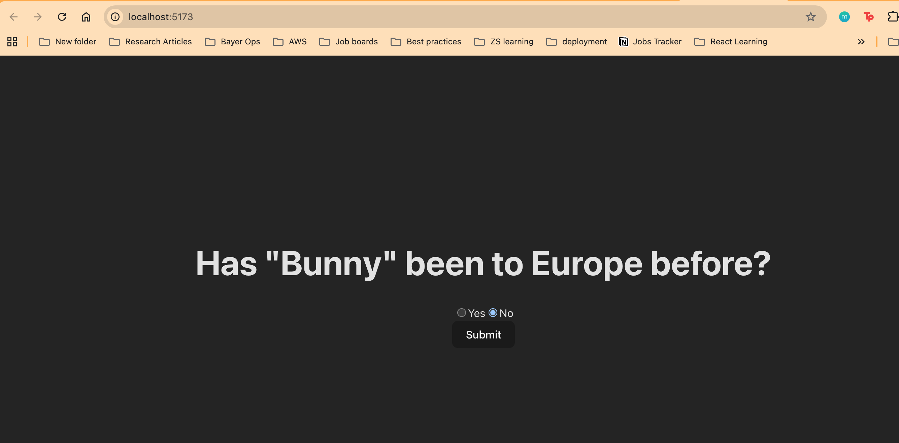
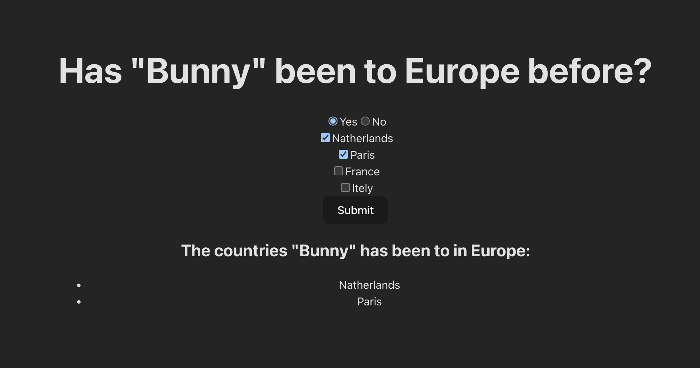
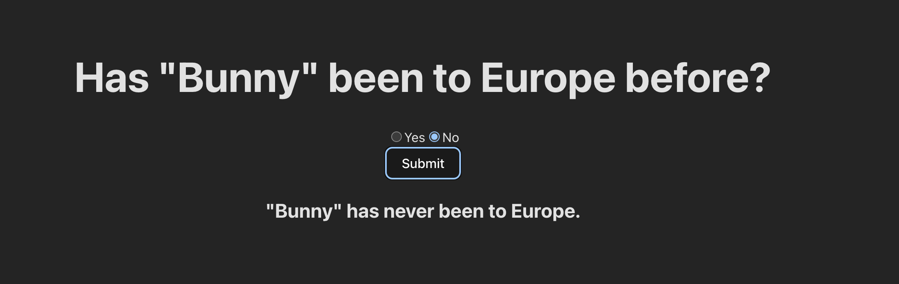

# bunny-in-europe

### Screen Prints of the Solution: 

### Steps to Run the solution (IN PROGRESS): 

1. Clone the Repo: 
    git clone https://github.com/gurdeepsingh991/bunny-in-europe.git
    cd bunny-in-europe
2. Go to DjangoFolder
    cd Django
3. Create virtual environment (MAC): 
    python -m venv .venv
    source .venv/bin/activate
4. Install dependencies:
    pip install django djangorestframework django-cors-headers
5. Apply migrations
    python manage.py migrate
6. Run Backend Server
    python manage.py runserver